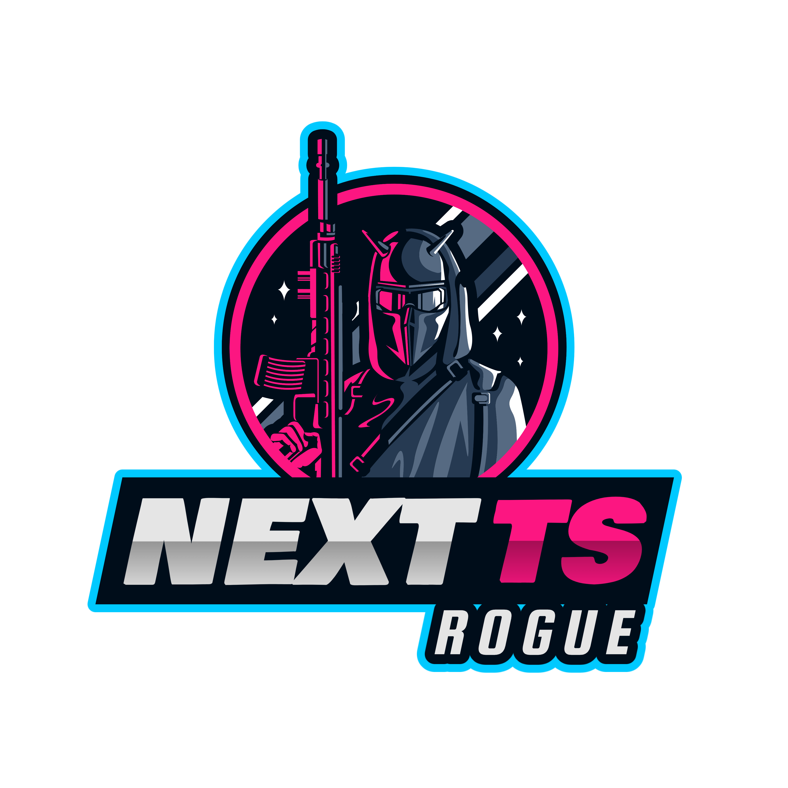

# NextTS Rogue - The Typescript/Next/React Course

## Introduction

Hello Everyone! This repo is dedicated to React-NextJS-Typescript course, here you can find all the codebase that will be used in each of the classes, also this master branch latest version, it's totally functional, and you can run the entire application from it, locally or deploying it with Vercel, which is one of the another topics covered in the course.

This application, it's a CRUD(Create/Update/Delete) of users and their credit cards, where we could visualise all the users created, create a new one, modify an existing one or either delete some.

It's built on the top of [NextJS framework](https://nextjs.org/), and the programming language that is used it's Typescript, which is a superset of Javascript.

## Dependencies

In order to have our project up and running in a fashion way, we will need the help of third party dependencies and libraries, and the used ones are:
- [Axios](https://www.npmjs.com/package/axios): Library used for doing HTTP/HTTPS requests.
- [axios-mock-adapter](https://www.npmjs.com/package/axios-mock-adapter): Used for creating mocks HTTP requests for our application.
- [mongoose](https://www.npmjs.com/package/mongoose): For interacting with the database.
- [express](https://www.npmjs.com/package/express): Used for exposing HTTP endpoints as the API server.
- [react-hook-form](https://www.npmjs.com/package/react-hook-form): Used to create hooks with our forms.
- [react-query](https://www.npmjs.com/package/react-query): Used for creating hooks and state management for each of the components.

## Course Classes Catalog

- Class 1 - Introduction to React and NextJS
- Class 2 - Installing the dependencies
- Class 3 - Creating the First Page
- Class 4 - Creating the _app.tsx
- Class 5 - Adding Style to our App
- Class 6 - Creating the Table Component
- Class 7 - Loading and Create Component  
- Class 8 - HTTP Fetch and Mocks
- Class 9 - React Query
- Class 10 - Create Customer Hook
- Class 11 - Single Customer Get and Delete Hook
- Class 12 - Delete and View Customer Component
- Class 13 - Update Customer Component 
- Class 14 - Update Customer Hook
- Class 15 - MongoDB Connection
- Class 16 - Creating the First API
- Class 17 - API Get/Delete Customer
- Class 18 - API Update Customer
- Class 19 - Deploying the Application on Vercel
- Class 20 - CI/CD Pipeline
- Class 21 - Last Steps